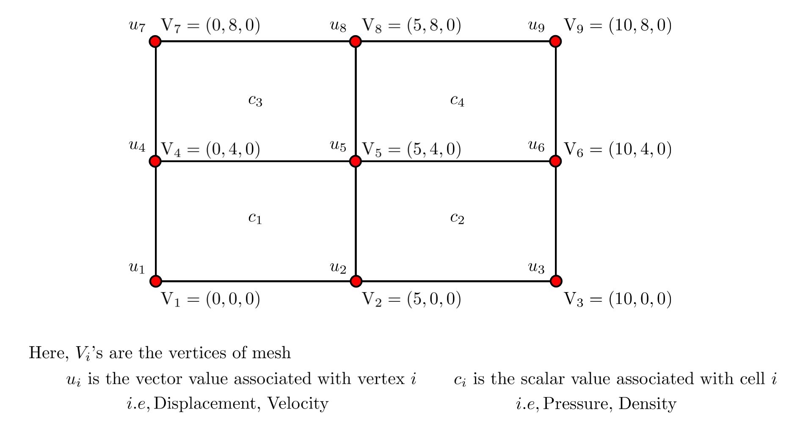

# 						mesh_VTU
This repository tries to explain the format of VTU file, and How to write a any geometry information as a VTU file. (Using MATLAB).

Basically, VTU in one of the file format of Visualization toolkit (VTK). It stands for Visualization toolkit of Unstructured_grid. There are other types of Visualization toolkit formats like, structured_points, structured_grid, Ploy_data, and more. Here, I would like to describe the structure of VTU file format in possible detailed manner and implement them in programming languages like MATLAB and Python. This helps in visualizing scientific data in software's like ParaView.

#### The major sections in VTU format are 

* Point information, 
* Cell information,
* Point data section (Data associated with the points).
* Cell data section (Data associated with cells).

Note : While reading the below section, I'll suggest you read any one of the example .vtu to actually observe the VTU structure. And also, geometry and other data used in the example  .vtu is shown pictorially in section:3. Go through those figures to get idea on implementation and adding more features.

#### Folder structure:

```
|-📁 Code/			# All the utilities functions and example scripts.
| |-📁 utils/			# Helping function functions.
|   |-topo_line.m		# Generates the line topology information based on point information.
|   |-topo_quad.m		# Generates the quad topology information based point and cell information.
|   |-topo_hexahedron.m		# Generates the hexehedron topology infomration based on point and cell information.
|   |-write_VTU.m		# Write all the data into vtu write format.
|   |-piece_vtu_inti.m		# Write initial commands of VTU.
|   |-piece_vtu_close.m		# Write the closing command of VTU.
|   |-write_piece_vtu.m		# Write the piece information into VTU.
|
| |-📁 examples			# Simple example scripts for understanding.
|   |-gen_line_vtu.m		# Generates the line vtu file from given set of points.
|   |-gen_quad_vtu.m		# Generates the surface vtu file.
|   |-gen_hex_vtu.m		# Generates the 3D geometry (with hexahedron elements) vtu file. 
|   |- gen_multiline_vtu	# Generates the multi-line vtu file (helpful for stream lines visualization).
     
```


#### Complete Structure of VTU format:

* First line should be the xml version.

* VTK file Type and its version. In our case we are using UnstrcturedGrid type and version 0.1.

* Except the point geometries, Any continuous geometry should be defined as piece. We use `<piece>` to start the geometry and use <\piece> to close the geometry, programmatically.  In order to define the multiple discontinuous geometries, respective geometries and their corresponding data will be defined with in `<piece>` and `</piece>` commands. 

* As initializing the piece, It is important to provide the number of points and cells information. 

* Within the piece, We provide all the necessary information as shown below. 
  
  * At first we have to provide the point information. we initialize this section with command `<Points>`.
    
  * Then, before entering actual data, we have to store in `<DataArray>` format. It is necessary to mentions the numerical type of the data, i.e float or int, then number of components (like x,y,z) correspond to the point.
    
  *  Add all the information of points in next line and close the DataArray and Points.
    
  * After providing the points information, Rest of the section is related to the Cell information.
  
    * First thing is connectivity, It is nothing but, index of set of point belongs to each cell. After mentioning the data close the data array.
    * Then offset, It is divides the connectivity information into the cells, It values are  range of vertices for each cell.
    * Last one is type of  the cells used for above topology.
  
  * Then we provide the point data  using `<PointData>` command.
    * While entering the actual data, We have to define the respective collection of information in DataArray format, this is the case with any kind of collection of information.
    * then data name. The provided data will be available with this name tag in the visualization software's like paraview.
    * Then format of the data, whether it is ascii or binary. 
    * Then provide the number of coordinate components it is having.
    * And number of components of data at any its corresponding vertex or cell.
    * After defining the  information, we provide the components of data of each vertex. 
    * Then we add  `<\DataArray>` at the end provided array section.
  
  * While writing the Cell data entire structure is same, but instead of point data, we just replace the PointData with CellData. 
  
    
  
  * Yeah, We reached to the end. Here, Close the all opened section above and view the file in Paraview.

#### Various VTU elements:


#### Example Geometries:

##### 1D Geometry:

See script	-	*gen_line.m* 

##### 2D Geometry:

See script	-	*gen_quad_vtu.m*


##### 3D Example Problem Geometry:

See script	-	*gen_hex_mesh.m*


